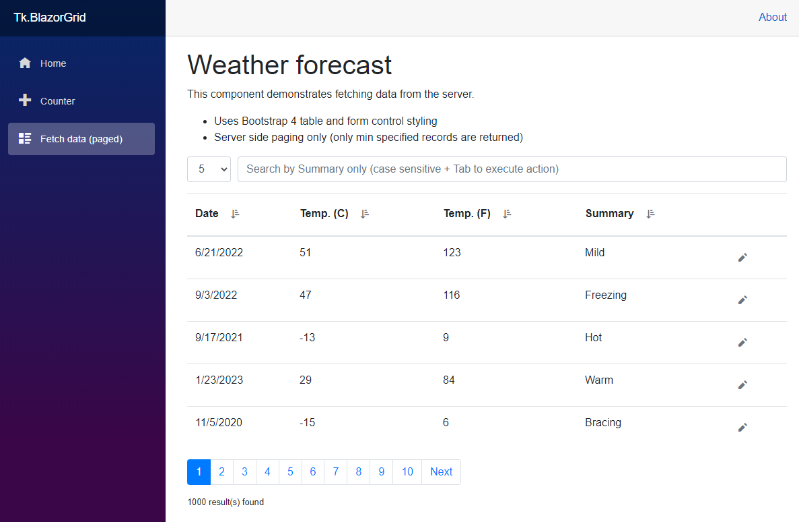

# Tk.BlazorGrid
> Since Blazor is relatively new and finding free, customizable grid component proved difficult. This is a venture to give the dev complete customization capabilty in implementing a grid component which uses server side paged data using httpget requests.This is a work in progress and for the most part works as expected, however improvements can be made and code can be organized better. 

> A simple low conf grid implementation using WASM Blazor. Includes paging, sorting and searching.

The application is written in the **Blazor WASM** **Asp.Net Core MVC - using .NET Core 3.1** **AspNetCore Hosted**

## Requirements
Visual Studio 2019 with .Net Core 3.1 installed

## Installation
- Application uses InMemory Database so no installation required to run this application

## How to use in your project
### Server/ Api
- Customize HttpGet request for paged data as shown in **WeatherForecastController** in **Tk.BlazorGrid.Server** project. All data needs to be mapped to **GridData<T>**.
### WASM Client
- Add reference TkGrid to _Imports.razor.
- Customize UI per fetchdata.razor

## Grid UI preview

## Acknowledgements
This web application is based on these projects:

- ASP.NET Core
- IdentityServer4.EntityFramework
- ASP.NET Core Identity
- Bootstrap 4

## Roadmap & Vision
- 1.0.0 Create a self supported standalone component - Done.
- 1.0.1 Create a common table component in TkGrid.

## Contributors
Contributors welcome
